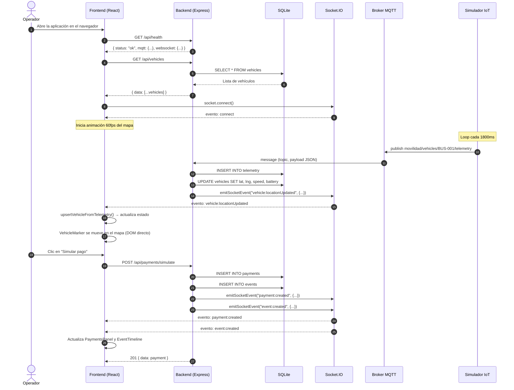
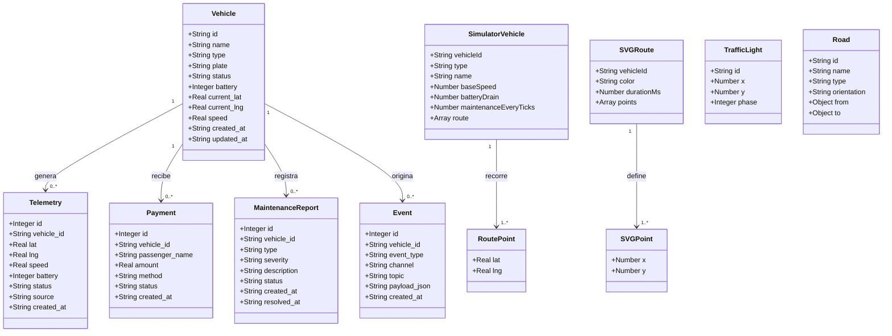
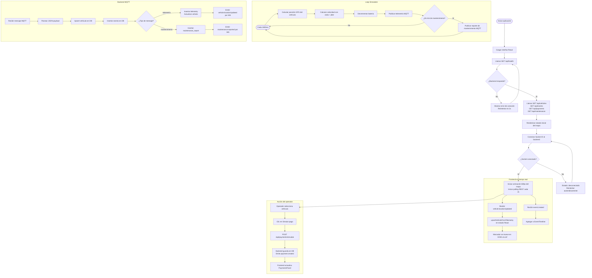
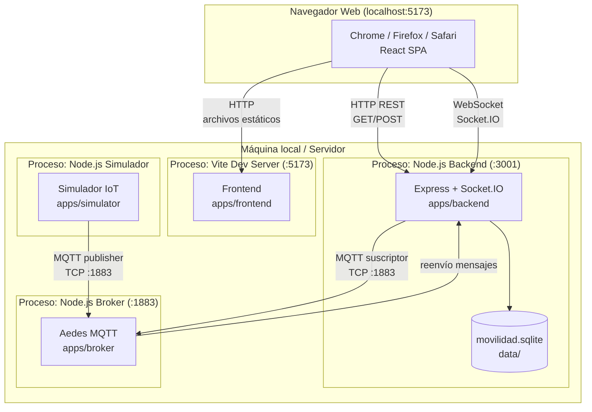

# Diagramas UML — Movilidad Inteligente POC

> Todos los diagramas están en formato Mermaid y pueden pegarse directamente en cualquier editor compatible (GitHub, GitLab, Notion, Obsidian, mermaid.live).

---

## A) Diagrama de Casos de Uso

```mermaid
flowchart TD
    subgraph Actores
        U[👤 Operador / Usuario]
        S[⚙️ Sistema de Movilidad]
        B[📡 Broker MQTT]
        V[🚌 Vehículo Simulado]
    end

    subgraph Casos de Uso
        UC1[Visualizar mapa urbano]
        UC2[Monitorear vehículos en tiempo real]
        UC3[Consultar estado de conexión]
        UC4[Visualizar rutas de vehículos]
        UC5[Ver información detallada del vehículo]
        UC6[Simular pago de pasajero]
        UC7[Reportar mantenimiento]
        UC8[Consultar historial de eventos]
        UC9[Simular recorrido IoT]
        UC10[Publicar telemetría MQTT]
        UC11[Persistir datos en base de datos]
        UC12[Notificar actualizaciones por WebSocket]
    end

    U --> UC1
    U --> UC2
    U --> UC3
    U --> UC4
    U --> UC5
    U --> UC6
    U --> UC7
    U --> UC8

    V --> UC9
    V --> UC10

    B --> UC10

    S --> UC11
    S --> UC12
    S --> UC2
```



---

## B) Diagrama de Componentes

```mermaid
graph TB
    subgraph Frontend["Frontend (React + Vite · :5173)"]
        APP[App.jsx\nOrquestador de estado]
        SHELL[MobileShell\nLayout general]
        STATUS[SystemStatus\nEstado de comunicaciones]
        MAP[SimulatedMap\nMapa SVG 60fps]
        MARKER[VehicleMarker\nMarcador de vehículo]
        CARD[VehicleStatusCard\nDetalle de vehículo]
        SEL[VehicleSelector\nSelector de unidad]
        OP[OperatorPanel\nPanel operador]
        PAY[PaymentsPanel\nPagos simulados]
        MAINT[MaintenancePanel\nMantenimiento]
        EVT[EventTimeline\nLínea de eventos]
        FLOW[CommunicationFlow\nDiagrama educativo]
        HTTP_CLIENT[api/http.js\nCliente REST]
        WS_CLIENT[api/socket.js\nCliente Socket.IO]
        MAP_CFG[map/cityMapConfig.js\nCalles, semáforos, puntos]
        ROUTES_CFG[map/routesConfig.js\nRutas SVG por vehículo]
        MAP_UTILS[map/mapUtils.js\nInterpolación de posición]
    end

    subgraph Backend["Backend (Express · :3001)"]
        API[REST API\n/api/*]
        SOCK_SRV[Socket.IO Server\nEmite eventos en tiempo real]
        MQTT_CLI[MQTT Client\nSuscriptor de topics]
        MSG_PROC[messageProcessor\nProcesa mensajes MQTT]
        DB[(SQLite\nmovilidad.sqlite)]
        HEALTH[/health]
        VEH_RT[/vehicles]
        EVT_RT[/events]
        PAY_RT[/payments]
        MAINT_RT[/maintenance]
    end

    subgraph Broker["Broker MQTT (Aedes · :1883)"]
        AEDES[Aedes TCP\nBroker MQTT]
    end

    subgraph Simulator["Simulador IoT (Node.js)"]
        SIM[Loop de publicación\ncada 1800ms]
        VEH_DEF[vehicles.js\nDefinición GPS + config]
    end

    APP --> HTTP_CLIENT
    APP --> WS_CLIENT
    APP --> SHELL
    SHELL --> STATUS
    SHELL --> MAP
    SHELL --> CARD
    SHELL --> SEL
    SHELL --> OP
    SHELL --> PAY
    SHELL --> MAINT
    SHELL --> EVT
    SHELL --> FLOW
    MAP --> MARKER
    MAP --> MAP_CFG
    MAP --> ROUTES_CFG
    MAP --> MAP_UTILS

    HTTP_CLIENT -->|GET/POST REST| API
    WS_CLIENT -->|Socket.IO| SOCK_SRV

    API --> HEALTH
    API --> VEH_RT
    API --> EVT_RT
    API --> PAY_RT
    API --> MAINT_RT
    API --> DB
    SOCK_SRV -->|emite eventos| WS_CLIENT
    MQTT_CLI -->|suscribe topics| AEDES
    MQTT_CLI --> MSG_PROC
    MSG_PROC --> DB
    MSG_PROC --> SOCK_SRV

    SIM --> VEH_DEF
    SIM -->|publish MQTT| AEDES
```

---

## C) Diagrama de Secuencia — Flujo principal de telemetría



---

## D) Modelo lógico de entidades



---

## E) Diagrama de Actividad — Flujo de funcionamiento



---

## F) Diagrama de Despliegue



---

## Notas sobre los diagramas

- Los diagramas A–F se basan exclusivamente en el código existente en el repositorio.
- Los nombres de clases y atributos del diagrama D coinciden con las columnas del schema SQL (`schema.sql`) y los campos de los payloads MQTT del simulador.
- El mapa no usa coordenadas geográficas reales en el SVG del frontend (usa coordenadas porcentuales 0–100). Las coordenadas reales (lat/lng de Ciudad Obregón, Sonora) sí se usan en el simulador para los mensajes MQTT.
- Los semáforos (`TrafficLight`) existen en `cityMapConfig.js` y se renderizan en el SVG, pero su estado (fase) es estático en esta versión del sistema.
